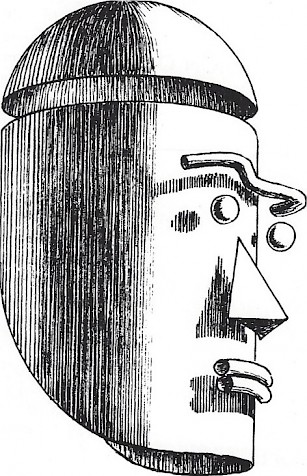

## Начинаем

[К содержанию](/index.md)

Мы знаем, что мы видим, но мы не всегда знаем, *как* мы узнаем то, что
мы видим.  Когда мы смотрим в окно, как мы узнаем насколько далеко
находится то или иное дерево?  Или как мы узнаем, насколько крут холм?
И как мы отличаем одну текстуру от другой, даже не касаясь их?  Мы
знаем это по собственному опыту... опыт, основанный на интерпретации
конкретных визуальных подсказок, которому мы учимся всю жизнь.  Если
художник знает, что это за подсказки и как ими пользоваться, то
создаваемые им иллюзии будут очень убедительными.

(Источник: http://guidetodrawing.com)

Наше зрительное восприятие реальности -- довольно сложное явление.
Однако его можно разделить на относительно небольшое число понятий,
которые, будучи усвоены, дают художнику гораздо большее понимание
того, что он видит и что должен изобразить.

Точно так же, как писатели должны научиться организовывать свои мысли
в слова, предложения, абзацы и главы, художники извлекают пользу из
изучения языка формы, цвета, текстуры, тени, изображения и композиции,
чтобы лучше организовать и передать свои мысли.

Читая это руководство и выполняя упражнения в конце каждой главы, вы
узнаете, какие перцептивные ключи используют наши глаза и разум для
интерпретации поверхностей, текстур, размеров, форм и пространственных
отношений всех вещей в окружающем нас мире, а также как использовать
эти ключи для передачи своих восприятий и представлений другим людям
посредством рисования и живописи.

В этом руководстве есть много правил, но они представляют только
некоторые из вариантов, доступных художнику, и не должны
интерпретироваться как исчерпывающие или абсолютные.  Скорее, художник
может и должен идти туда, куда ведет воображение.

В этом руководстве я представляю свой метод рисования; есть много
других, и вы будете развивать свой собственный.  Но пока его нет,
воспользуйтесь моим.

[К содержанию](/index.md)
